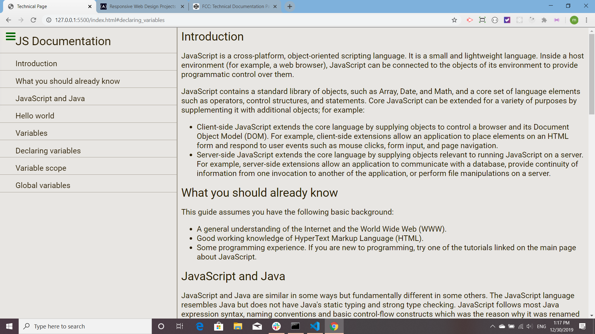
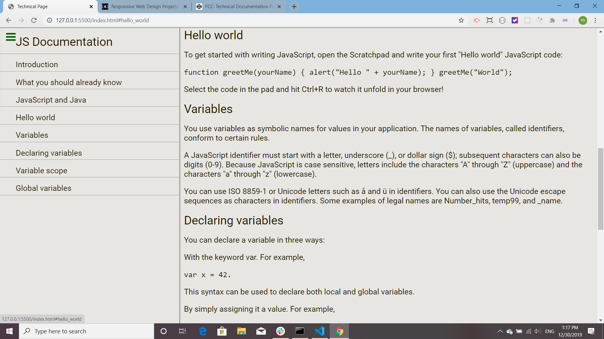
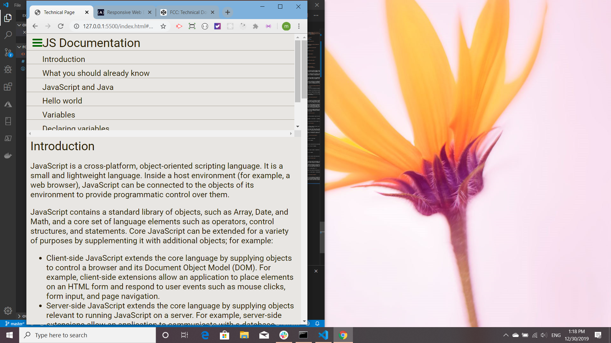

# FCC Technical Design Page

This technical design page is an exercise for [The Free Code Camp](https://www.freecodecamp.org/). All code is mine. The accordian menu in the top left hand corner is the testing software.

This is the page on opening:

Notice that when the size is 100% that there is a fixed sidebar. This disappears when under 750 pixels wide.

This is the page resized under 750 pixels:

This page is [published on Git Hub](https://martucazpo.github.io/FCC-tech-page/).